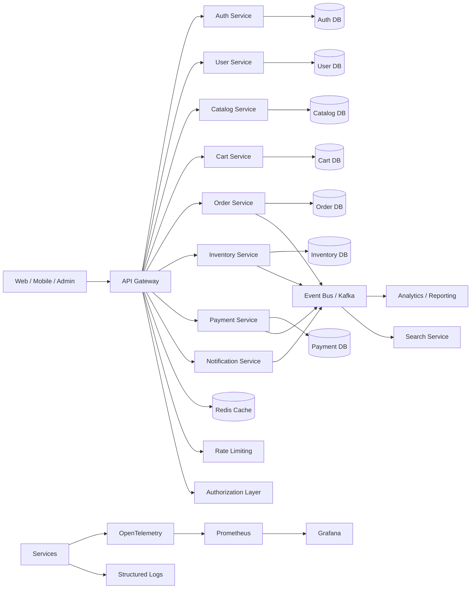
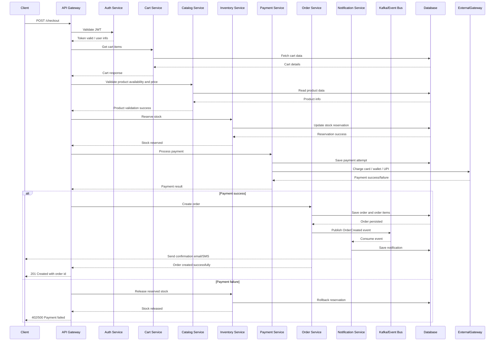

# Production-Grade E-Commerce Architecture and Design Patterns

This document is a complete high-level and low-level design guide for a production-grade e-commerce platform using microservices, an API gateway, authentication and authorization, rate limiting, observability with Prometheus and Grafana, and JUnit-based testing.

The goal is to help you prepare for interviews and also think like a senior backend engineer building a real-world system.

---

## 1. Business Context
A modern e-commerce system usually includes:
- User registration and login
- Product catalog
- Search and filtering
- Cart management
- Checkout and payment
- Order tracking
- Inventory management
- Notification delivery
- Admin operations

In a real production system, this is not built as one monolith. It is split into multiple services because of:
- independent scaling
- fault isolation
- faster deployments
- team ownership
- easier maintenance

---

## 2. High-Level Architecture



---

## 3. Core Services in the E-Commerce Platform

### 3.1 API Gateway
Responsibilities:
- Route traffic to the correct service
- Apply authentication and authorization checks
- Rate limiting and throttling
- Request logging and monitoring
- Load balancing and failover

Why it is needed:
- Clients should not directly call every service
- Centralized security and traffic management
- Easier versioning and rollout

Design patterns used:
- API Gateway pattern
- Reverse Proxy pattern
- Edge pattern

Typical technologies:
- Spring Cloud Gateway
- Kong
- NGINX
- Zuul (older)

---

### 3.2 Auth Service
Responsibilities:
- Register users
- Login and token generation
- Refresh tokens
- Password reset
- Role and permission management

Important concepts:
- Authentication = who are you?
- Authorization = what can you do?

Design patterns used:
- Singleton for config
- Factory for provider-based authentication
- Strategy for OAuth providers
- Token Service pattern

Typical modern approach:
- JWT access token + refresh token
- OAuth2 / OpenID Connect
- RBAC (Role-Based Access Control)
- ABAC (Attribute-Based Access Control) for advanced authorization

---

### 3.3 User Service
Responsibilities:
- Store user profiles
- Manage addresses
- Manage preferences
- Customer profile operations

Design patterns used:
- Repository pattern
- DTO pattern
- Builder pattern for complex user profile objects
- Service layer pattern

---

### 3.4 Catalog Service
Responsibilities:
- Manage products
- Product categories
- Prices and inventory metadata
- Search metadata

Important concerns:
- High read traffic
- Search optimization
- Product view caching

Design patterns used:
- Cache-Aside pattern
- CQRS pattern (read-heavy operations)
- Repository pattern
- Strategy for price calculation rules

---

### 3.5 Cart Service
Responsibilities:
- Add/remove item to cart
- Update quantity
- Apply promotions
- Persist cart state for logged-in and guest users

Important concerns:
- Cart is highly user-specific
- Short-lived but important
- Must be fast and reliable

Design patterns used:
- Session-based state pattern
- Repository pattern
- Builder pattern for cart line items
- Command pattern for cart operations

---

### 3.6 Inventory Service
Responsibilities:
- Check stock availability
- Reserve stock
- Update inventory after order completion
- Handle backorder rules

Important concerns:
- Inventory correctness is critical
- Must prevent overselling
- Should be highly consistent

Design patterns used:
- Saga pattern
- Optimistic locking
- Idempotency pattern
- Retry pattern
- Compensating transaction pattern

---

### 3.7 Order Service
Responsibilities:
- Create orders
- Track order state
- Handle order history
- Manage order status transitions

Important concerns:
- Orders have state transitions
- Must be durable and auditable
- Must support retries and failures

Design patterns used:
- State pattern
- Saga pattern
- Observer pattern for order-status events
- Event-driven architecture

---

### 3.8 Payment Service
Responsibilities:
- Process payments
- Support multiple gateways
- Handle payment failures and retries
- Refund logic

Important concerns:
- Payments are sensitive
- Must be secure and idempotent

Design patterns used:
- Strategy pattern for payment methods
- Adapter pattern for gateway integration
- Facade pattern for payment orchestration
- Command pattern for payment commands

---

### 3.9 Notification Service
Responsibilities:
- Send emails, SMS, push notifications
- Order confirmations
- OTP and password reset emails

Design patterns used:
- Factory pattern for notification providers
- Observer pattern for event-based notifications
- Template Method pattern for email templates

---

## 4. High-Level Design Patterns Used in the System

### 4.1 Microservices Architecture
This is the foundation.

Benefits:
- Independent deployment
- Team autonomy
- Scalability
- Failure isolation

Drawbacks:
- Distributed system complexity
- Network latency
- Data consistency challenges

---

### 4.2 API Gateway Pattern
Used to centralize routing, security, and traffic control.

Why important:
- One entry point for all clients
- Avoids exposing internal services directly

---

### 4.3 CQRS Pattern
Used for read-heavy operations like product catalog and search.

Pattern idea:
- Command side: write operations
- Query side: read optimizations

Example:
- Product write updates the main database
- Search service builds an index for fast reads

---

### 4.4 Saga Pattern
Used for distributed transactions across services.

Example:
1. Reserve inventory
2. Charge payment
3. Create order
4. If payment fails, rollback inventory reservation

Implementation styles:
- Choreography-based saga
- Orchestration-based saga

---

### 4.5 Circuit Breaker Pattern
Used when a downstream service is slow or unavailable.

Benefits:
- Prevent cascading failures
- Fast-fail instead of waiting forever

Common libraries:
- Resilience4j
- Hystrix (older)

---

### 4.6 Retry Pattern
Used for transient failures.

Example:
- Network timeout when calling payment gateway
- Retry with exponential backoff

Important note:
- Must be idempotent to avoid duplicate operations

---

### 4.7 Bulkhead Pattern
Used to isolate resources so one failure does not consume all capacity.

Example:
- Payment calls use a separate thread pool from catalog reads

---

### 4.8 Cache-Aside Pattern
Used to reduce database load for frequently requested product and category data.

Flow:
1. Check cache
2. If miss, read DB
3. Populate cache

---

### 4.9 Outbox Pattern
Used to ensure events are reliably published after a database transaction commits.

Why important:
- Prevents lost events when the app crashes after writing DB but before publishing message

---

### 4.10 Idempotency Pattern
Used for payment and order creation operations.

Why important:
- Prevent duplicates when retries happen

Example:
- Payment request includes an idempotency key

---

## 5. Low-Level Design Patterns and Their Placement

### 5.1 Repository Pattern
Used in each service to abstract data access.

Example responsibilities:
- CRUD operations
- Query methods
- Persistence abstraction

Benefit:
- Business logic stays independent from database details

---

### 5.2 Service Layer Pattern
Used to contain business rules.

Example:
- OrderService handles order creation rules
- PaymentService handles payment rules

Benefit:
- Controllers stay thin

---

### 5.3 DTO Pattern
Used to separate internal domain objects from API payloads.

Example:
- Domain entity: Order
- API DTO: CreateOrderRequest

Benefit:
- Avoids leaking internal schema

---

### 5.4 Builder Pattern
Used when object creation is complex.

Example:
- Building a CheckoutRequest
- Building an Order object with many optional fields

---

### 5.5 Strategy Pattern
Used for interchangeable payment methods and shipping rules.

Example:
- CreditCardStrategy
- PayPalStrategy
- WalletStrategy

---

### 5.6 Factory Pattern
Used to create notification providers or authentication handlers.

Example:
- NotificationFactory returns Email/SMS/Push services

---

### 5.7 Adapter Pattern
Used when integrating with third-party payment systems or legacy systems.

Example:
- PaymentGatewayAdapter wraps a legacy gateway

---

### 5.8 Facade Pattern
Used to simplify interactions across multiple subsystems.

Example:
- CheckoutFacade orchestrates inventory, payment, and shipping

---

### 5.9 Observer Pattern
Used for event-driven updates.

Example:
- Order status changes notify email, SMS, and dashboard systems

---

### 5.10 State Pattern
Used for order lifecycle management.

Example states:
- CREATED
- PAID
- PACKED
- SHIPPED
- DELIVERED
- CANCELLED

---

## 6. Security Design for Production

### 6.1 Authentication
Use:
- OAuth2 / OIDC
- JWT access token
- Refresh token rotation

Recommended flow:
1. Client logs in
2. Auth service issues access token and refresh token
3. Gateway validates token
4. Services trust the validated identity from gateway or token validation layer

---

### 6.2 Authorization
Use role-based and permission-based control.

Example roles:
- CUSTOMER
- ADMIN
- SUPPORT
- GUEST

Authorization patterns:
- RBAC for common scenarios
- ABAC for dynamic rules

Example:
- Only admin can view all orders
- Only owner can access their cart

---

### 6.3 Rate Limiting
Protect APIs from abuse and overload.

Use:
- Token bucket or leaky bucket algorithm
- Limits per user, IP, and API route

Typical rules:
- 100 requests/minute for normal users
- 1000 requests/minute for trusted clients

---

### 6.4 Secrets and Configuration
Use:
- Vault
- AWS Secrets Manager
- Azure Key Vault
- Kubernetes Secrets

Do not hardcode secrets in code.

---

### 6.5 Security Best Practices
- Encrypt sensitive data at rest and in transit
- Apply HTTPS everywhere
- Use input validation and sanitization
- Prevent SQL injection and XSS
- Use CSRF protection where relevant
- Enforce least privilege access

---

## 7. Logging, Monitoring, and Observability

### 7.1 Logging Strategy
Use structured logs with fields like:
- requestId
- userId
- traceId
- serviceName
- statusCode
- latency
- errorType

Example log structure:
```json
{
  "timestamp": "2026-07-14T10:00:00Z",
  "service": "order-service",
  "event": "order.created",
  "orderId": "ORD-1001",
  "userId": "USR-42",
  "status": "SUCCESS"
}
```

---

### 7.2 Prometheus and Grafana
Prometheus is used for metrics collection.

Typical metrics:
- request count
- request latency
- error rate
- JVM memory usage
- database connection pool usage
- queue lag

Grafana is used for dashboards and alerting.

Useful dashboards:
- API latency
- Error rate per service
- CPU and memory usage
- Payment failure rate
- Order throughput

---

### 7.3 Distributed Tracing
Use OpenTelemetry or Zipkin.

Why important:
- A request may span multiple services
- You need end-to-end trace visibility

Example trace flow:
- Gateway -> Auth -> Catalog -> Cart -> Order -> Payment

---

## 8. Event-Driven Design
Microservices often communicate through events.

### Example event flow
```text
Order Service -> publish OrderCreated
Inventory Service -> consume and reserve stock
Payment Service -> consume and process payment
Notification Service -> consume and send email
```

Message broker options:
- Kafka
- RabbitMQ
- Azure Service Bus
- Amazon SQS/SNS

Benefits:
- loose coupling
- async processing
- better scalability

Important practices:
- use schema registry
- support retry and dead-letter queues
- ensure exactly-once semantics where possible

---

## 9. Data Design in Microservices

### 9.1 Database Per Service
Each service should ideally own its own database.

Example:
- Order Service -> Order DB
- Inventory Service -> Inventory DB
- Catalog Service -> Catalog DB

Benefit:
- reduces coupling
- allows independent scaling

---

### 9.2 Shared Data Caveats
Do not share a single database across all services unless necessary.

If shared data is needed, use:
- API-based access
- event-driven synchronization
- read models

---

### 9.3 Data Consistency
In microservices, full ACID transactions across services are hard.

Use patterns like:
- Saga pattern
- Outbox pattern
- Eventual consistency
- Compensation logic

---

## 10. Testing Strategy for Production Systems

### 10.1 Unit Testing
Use JUnit 5 and Mockito for isolated component testing.

Example scope:
- service methods
- utility classes
- validation rules
- strategy selection logic

---

### 10.2 Integration Testing
Test real interactions between components.

Examples:
- repository + database
- service + Redis
- service + Kafka

Use Testcontainers for real dependencies.

---

### 10.3 Contract Testing
Ensure service APIs remain compatible.

Useful for:
- consumer-producer compatibility
- gateway-to-service contracts

---

### 10.4 End-to-End Testing
Validate full user flows.

Example flow:
1. User signs in
2. Adds product to cart
3. Checks out
4. Order created
5. Payment success
6. Notification sent

---

### 10.5 Performance Testing
Use:
- JMeter
- Gatling
- k6

Test:
- heavy traffic scenarios
- product search load
- checkout bottlenecks
- payment timeout behavior

---

## 11. Example Spring Boot-Based Low-Level Design

### 11.1 Layered Structure
```text
Controller
  -> Service
    -> Repository
      -> Database
```

### 11.2 Example Service Class
```java
@Service
public class OrderService {

    private final OrderRepository orderRepository;
    private final InventoryClient inventoryClient;
    private final PaymentClient paymentClient;

    public OrderService(OrderRepository orderRepository,
                        InventoryClient inventoryClient,
                        PaymentClient paymentClient) {
        this.orderRepository = orderRepository;
        this.inventoryClient = inventoryClient;
        this.paymentClient = paymentClient;
    }

    public Order createOrder(CreateOrderRequest request) {
        // validate request
        // reserve inventory
        // process payment
        // save order
        return null;
    }
}
```

### 11.3 Example Controller
```java
@RestController
@RequestMapping("/orders")
public class OrderController {

    private final OrderService orderService;

    public OrderController(OrderService orderService) {
        this.orderService = orderService;
    }

    @PostMapping
    public ResponseEntity<Order> createOrder(@RequestBody CreateOrderRequest request) {
        return ResponseEntity.ok(orderService.createOrder(request));
    }
}
```

---

## 12. Production-Grade Missing Things You Must Consider
This is the part many beginners miss.

### 12.1 Resilience
You need:
- retries
- circuit breakers
- timeouts
- fallback logic
- bulkheads

Without this, one failing service can take down the whole system.

---

### 12.2 Idempotency
Payments and orders must not be duplicated when the client retries.

Use:
- idempotency keys
- unique request identifiers

---

### 12.3 Dead Letter Queues
If an event fails repeatedly, it should go to a DLQ for later inspection.

---

### 12.4 Observability
You need logs, metrics, and traces together.

A system without observability is a black box.

---

### 12.5 Secrets Management
Never hardcode passwords or API keys.

Use secret managers.

---

### 12.6 CI/CD and Deployment
Use:
- GitHub Actions / Jenkins / GitLab CI
- Docker images
- Kubernetes deployment manifests
- Helm charts
- Blue-green or canary deployment

---

### 12.7 Backup and Recovery
Plan for:
- database backup
- restore procedure
- disaster recovery

---

### 12.8 Compliance and Data Privacy
For real-world systems, think about:
- GDPR
- PCI DSS for payments
- audit logs
- data retention

---

### 12.9 Multi-Region and High Availability
Production systems often need:
- failover support
- replicated databases
- load balancing
- low-latency access

---

## 13. Recommended Production Stack
A strong modern stack could be:
- Java 21 + Spring Boot 3
- Spring Cloud Gateway
- Spring Security + OAuth2 Resource Server
- Spring Data JPA / PostgreSQL
- Redis for caching
- Kafka for async events
- Prometheus + Grafana + OpenTelemetry
- Docker + Kubernetes
- JUnit 5 + Mockito + Testcontainers

---

## 14. Interview-Focused Summary
If you are preparing for interviews, remember this answer:

A production-grade e-commerce system uses:
- microservices for independent domains
- API gateway for routing and security
- authentication and authorization for access control
- rate limiting to protect APIs
- event-driven architecture for loose coupling
- saga pattern for distributed transactions
- circuit breaker and retries for resilience
- Prometheus and Grafana for monitoring
- JUnit and integration tests for reliability

---

## 15. Full Spring Boot Project Structure
Here is a realistic Spring Boot-based project structure for this architecture.

```text
ecommerce-platform/
├── api-gateway/
│   ├── src/main/java/com/ecommerce/gateway/
│   │   ├── GatewayApplication.java
│   │   ├── config/
│   │   │   └── RouteConfig.java
│   │   ├── filter/
│   │   │   └── JwtAuthenticationFilter.java
│   │   └── controller/
│   │       └── HealthController.java
│   └── src/main/resources/
│       └── application.yml
│
├── auth-service/
│   ├── src/main/java/com/ecommerce/auth/
│   │   ├── AuthApplication.java
│   │   ├── controller/
│   │   │   └── AuthController.java
│   │   ├── service/
│   │   │   └── AuthService.java
│   │   ├── repository/
│   │   │   └── UserRepository.java
│   │   ├── security/
│   │   │   ├── JwtUtil.java
│   │   │   └── SecurityConfig.java
│   │   └── dto/
│   │       ├── LoginRequest.java
│   │       └── RegisterRequest.java
│   └── src/test/java/com/ecommerce/auth/
│       └── AuthServiceTest.java
│
├── user-service/
│   ├── src/main/java/com/ecommerce/user/
│   │   ├── UserApplication.java
│   │   ├── controller/
│   │   │   └── UserController.java
│   │   ├── service/
│   │   │   └── UserService.java
│   │   ├── repository/
│   │   │   └── UserProfileRepository.java
│   │   └── model/
│   │       └── UserProfile.java
│   └── src/test/java/com/ecommerce/user/
│       └── UserServiceTest.java
│
├── catalog-service/
│   ├── src/main/java/com/ecommerce/catalog/
│   │   ├── CatalogApplication.java
│   │   ├── controller/
│   │   │   └── ProductController.java
│   │   ├── service/
│   │   │   └── ProductService.java
│   │   ├── repository/
│   │   │   └── ProductRepository.java
│   │   └── model/
│   │       └── Product.java
│   └── src/test/java/com/ecommerce/catalog/
│       └── ProductServiceTest.java
│
├── cart-service/
│   ├── src/main/java/com/ecommerce/cart/
│   │   ├── CartApplication.java
│   │   ├── controller/
│   │   │   └── CartController.java
│   │   ├── service/
│   │   │   └── CartService.java
│   │   ├── repository/
│   │   │   └── CartRepository.java
│   │   └── model/
│   │       └── CartItem.java
│   └── src/test/java/com/ecommerce/cart/
│       └── CartServiceTest.java
│
├── inventory-service/
│   ├── src/main/java/com/ecommerce/inventory/
│   │   ├── InventoryApplication.java
│   │   ├── controller/
│   │   │   └── InventoryController.java
│   │   ├── service/
│   │   │   └── InventoryService.java
│   │   └── model/
│   │       └── StockItem.java
│   └── src/test/java/com/ecommerce/inventory/
│       └── InventoryServiceTest.java
│
├── order-service/
│   ├── src/main/java/com/ecommerce/order/
│   │   ├── OrderApplication.java
│   │   ├── controller/
│   │   │   └── OrderController.java
│   │   ├── service/
│   │   │   └── OrderService.java
│   │   ├── repository/
│   │   │   └── OrderRepository.java
│   │   ├── state/
│   │   │   └── OrderState.java
│   │   └── event/
│   │       └── OrderEventPublisher.java
│   └── src/test/java/com/ecommerce/order/
│       └── OrderServiceTest.java
│
├── payment-service/
│   ├── src/main/java/com/ecommerce/payment/
│   │   ├── PaymentApplication.java
│   │   ├── controller/
│   │   │   └── PaymentController.java
│   │   ├── service/
│   │   │   └── PaymentService.java
│   │   ├── strategy/
│   │   │   ├── PaymentStrategy.java
│   │   │   ├── CardPaymentStrategy.java
│   │   │   └── PayPalPaymentStrategy.java
│   │   └── adapter/
│   │       └── GatewayAdapter.java
│   └── src/test/java/com/ecommerce/payment/
│       └── PaymentServiceTest.java
│
├── notification-service/
│   ├── src/main/java/com/ecommerce/notification/
│   │   ├── NotificationApplication.java
│   │   ├── service/
│   │   │   └── NotificationService.java
│   │   └── factory/
│   │       └── NotificationFactory.java
│   └── src/test/java/com/ecommerce/notification/
│       └── NotificationServiceTest.java
│
├── shared-lib/
│   └── src/main/java/com/ecommerce/common/
│       ├── dto/
│       ├── exception/
│       └── util/
│
├── infrastructure/
│   ├── docker/
│   ├── k8s/
│   ├── prometheus/
│   └── grafana/
│
└── docker-compose.yml
```

### Suggested Spring Boot dependencies
Each service can include:
- spring-boot-starter-web
- spring-boot-starter-security
- spring-boot-starter-data-jpa
- spring-boot-starter-validation
- spring-boot-starter-actuator
- spring-kafka
- spring-cloud-starter-gateway
- spring-cloud-starter-circuitbreaker-resilience4j
- spring-boot-starter-test
- spring-boot-testcontainers

### Suggested application layering
Each service should follow:
- Controller
- Service
- Repository
- Model/Entity
- DTO
- Exception handling
- Configuration
- Tests

---

## 16. Detailed Sequence Diagram for Checkout and Order Flow
This is the most important flow in an e-commerce system.



### What happens in this flow
1. Client sends checkout request through the gateway.
2. Gateway validates authentication.
3. Cart service provides current cart items.
4. Catalog service validates products and prices.
5. Inventory service reserves stock for the order.
6. Payment service processes payment.
7. If payment succeeds, order service creates the order and publishes an event.
8. Notification service sends confirmation.
9. If payment fails, the reservation is released and the user sees a failure response.

### Important production concerns in this flow
- Idempotency key for payment and order creation
- Retry logic for payment gateway failures
- Circuit breaker for downstream services
- Saga pattern for multi-service transaction handling
- Outbox pattern for reliable event publishing
- Dead-letter queue for failed events
- Trace ID and correlation ID across services
- Audit log for order and payment actions

---

## 17. What You Should Learn Next
To move from theory to implementation, the next steps should be:
1. Design the service boundaries
2. Define the APIs between services
3. Choose the event model
4. Plan the database per service strategy
5. Add security and rate limiting
6. Implement monitoring and alerting
7. Write unit and integration tests
8. Build a sample codebase with Spring Boot services

---

## 18. React Frontend Guide for the Same E-Commerce Architecture
A production-grade frontend should be designed to match the backend services and the user journeys. The UI should feel like a single application, but internally it should be split into modules.

### 18.1 Recommended React Architecture
Use a modular frontend structure like this:

```text
src/
├── app/
│   ├── routes/
│   ├── store/
│   ├── layout/
│   └── providers/
├── features/
│   ├── auth/
│   ├── catalog/
│   ├── cart/
│   ├── checkout/
│   ├── orders/
│   ├── account/
│   └── admin/
├── shared/
│   ├── components/
│   ├── hooks/
│   ├── api/
│   ├── utils/
│   └── styles
├── services/
│   ├── authApi.ts
│   ├── catalogApi.ts
│   ├── cartApi.ts
│   ├── orderApi.ts
│   └── paymentApi.ts
└── main.tsx
```

### 18.2 Why this structure is useful
- Feature-based folders keep code organized
- Shared components reduce repetition
- A separate API layer makes backend changes easier
- Clear separation between UI, business logic, and data fetching

---

### 18.3 Frontend Modules and Their Responsibilities

#### 18.3.1 Auth Module
Responsibilities:
- Login page
- Register page
- Forgot password
- Logout
- Token storage and refresh

Backend mapping:
- Auth Service

Key UI flows:
- User logs in
- JWT token stored securely
- Protected routes are accessible only after authentication

Suggested components:
- LoginForm
- RegisterForm
- ProtectedRoute
- AuthProvider

Suggested state:
- authUser
- accessToken
- refreshToken
- isAuthenticated

---

#### 18.3.2 Catalog Module
Responsibilities:
- Home page
- Product listing
- Product detail page
- Search and filters
- Category browsing

Backend mapping:
- Catalog Service

Key UI flows:
- User browses products
- User filters by category, price, brand, rating
- User opens product detail

Suggested components:
- ProductCard
- ProductGrid
- ProductFilters
- SearchBar
- ProductDetailPage

Suggested state:
- products
- selectedCategory
- searchQuery
- pagination

---

#### 18.3.3 Cart Module
Responsibilities:
- Add item to cart
- Update quantity
- Remove item
- Show cart summary
- Apply coupon

Backend mapping:
- Cart Service

Key UI flows:
- User adds a product to cart
- Cart count updates in header
- Cart page shows subtotal, shipping, and total

Suggested components:
- CartPage
- CartItemCard
- CartSummary
- CouponInput

Suggested state:
- cartItems
- cartCount
- subtotal
- shippingFee
- totalAmount

---

#### 18.3.4 Checkout Module
Responsibilities:
- Address selection
- Delivery method
- Payment method selection
- Review order
- Place order

Backend mapping:
- Checkout flow across Cart, Inventory, Payment, and Order services

Key UI flows:
- User reviews cart
- Selects address and payment method
- Confirms order
- Redirects to success page

Suggested components:
- CheckoutPage
- AddressForm
- PaymentMethodSelector
- OrderReview
- PlaceOrderButton

Suggested state:
- selectedAddress
- selectedPaymentMethod
- shippingMethod
- checkoutLoading
- orderSuccess

---

#### 18.3.5 Orders Module
Responsibilities:
- Display order history
- Track current orders
- Show order status
- Cancel or return order

Backend mapping:
- Order Service

Key UI flows:
- User sees placed orders
- User views tracking status
- User opens order details

Suggested components:
- OrderListPage
- OrderCard
- OrderTrackingTimeline

Suggested state:
- orders
- selectedOrder
- orderStatus

---

#### 18.3.6 Account Module
Responsibilities:
- Profile management
- Address book
- Preferences
- Saved payment methods

Backend mapping:
- User Service

Suggested components:
- ProfileForm
- AddressBook
- AccountSettings

---

#### 18.3.7 Admin Module
Responsibilities:
- Product management
- Inventory updates
- Order management
- Customer support tools

Backend mapping:
- Catalog, Inventory, Order services

Suggested components:
- AdminDashboard
- ProductAdminTable
- InventoryManager
- OrderAdminPanel

---

### 18.4 Routing Design
A good e-commerce frontend should have clear routes.

```text
/                      -> Home page
/login                 -> Login
/register              -> Register
/products              -> Product listing
/products/:id          -> Product detail
/cart                  -> Cart page
/checkout              -> Checkout page
/orders                -> Order history
/orders/:id            -> Order detail
/account               -> Profile
/admin                 -> Admin dashboard
```

Recommended router library:
- React Router DOM

---

### 18.5 State Management Strategy
Use a combination of local state and global state.

#### Recommended options
- React Context for auth and theme
- Redux Toolkit or Zustand for global cart and user state
- React Query / TanStack Query for server state

#### Why this is important
- API data is asynchronous
- Cart and auth state are shared across pages
- Server state should not be manually managed in many places

Example store ideas:
- authStore
- cartStore
- productStore
- orderStore

---

### 18.6 API Layer Design
The frontend should not directly call backend URLs from UI components. It should use a centralized API layer.

Example structure:

```ts
// services/authApi.ts
export const authApi = {
  login: (data) => api.post('/auth/login', data),
  register: (data) => api.post('/auth/register', data),
  refreshToken: () => api.post('/auth/refresh'),
};
```

```ts
// services/cartApi.ts
export const cartApi = {
  getCart: () => api.get('/cart'),
  addItem: (item) => api.post('/cart/items', item),
  updateQty: (id, qty) => api.put(`/cart/items/${id}`, { quantity: qty }),
  removeItem: (id) => api.delete(`/cart/items/${id}`),
};
```

```ts
// services/orderApi.ts
export const orderApi = {
  createOrder: (data) => api.post('/orders', data),
  getOrders: () => api.get('/orders'),
  getOrderById: (id) => api.get(`/orders/${id}`),
};
```

Recommended libraries:
- Axios or Fetch
- TanStack Query for caching and loading states

---

### 18.7 Authentication and Authorization in React
The frontend must handle:
- login persistence
- protected routes
- role-based UI rendering

Recommended approach:
- Store JWT in secure HTTP-only cookie if possible
- If using local storage, keep it minimal and secure
- Redirect unauthenticated users to login
- Hide admin pages from non-admin users

Example idea:
```tsx
<ProtectedRoute role="ADMIN">
  <AdminDashboard />
</ProtectedRoute>
```

---

### 18.8 UI/UX Patterns for E-Commerce
A strong e-commerce UI needs these patterns:
- responsive product cards
- sticky cart summary on checkout
- loading skeletons
- optimistic UI updates for cart
- toast notifications for success/error
- search suggestions
- pagination or infinite scroll
- accessibility support

Suggested UI libraries:
- Material UI
- Ant Design
- Tailwind CSS
- Chakra UI

---

### 18.9 Example User Flow Mapping

#### 18.9.1 User Signup Flow
```text
User -> Register Page -> Auth Service -> Dashboard -> Profile Setup
```

#### 18.9.2 Product Browsing Flow
```text
User -> Home Page -> Catalog Service -> Product Listing -> Product Detail
```

#### 18.9.3 Add to Cart Flow
```text
User -> Product Detail -> Add to Cart -> Cart Service -> Cart Page
```

#### 18.9.4 Checkout Flow
```text
User -> Checkout Page -> Address Form -> Payment Selection -> Order Placement -> Success Page
```

#### 18.9.5 Order Tracking Flow
```text
User -> Orders Page -> Order Detail -> Status Timeline -> Delivery Info
```

---

### 18.10 React Components by Service

#### For Auth Service
- LoginPage
- RegisterPage
- ForgotPasswordPage
- AuthLayout

#### For Catalog Service
- HomePage
- CategoryPage
- ProductPage
- SearchPage

#### For Cart Service
- CartPage
- MiniCart
- CartItemRow

#### For Order Service
- OrdersPage
- OrderDetailPage
- TrackOrderPage

#### For Payment Service
- PaymentMethodPage
- PaymentSuccessPage
- PaymentFailurePage

---

### 18.11 Performance Considerations
For production-grade React apps:
- lazy load pages with React.lazy
- code split by route
- memoize expensive components
- use pagination or virtualization for large lists
- cache API responses where appropriate
- use image optimization for products

Example:
```tsx
const ProductPage = lazy(() => import('./pages/ProductPage'));
```

---

### 18.12 Testing the Frontend
Use:
- Jest
- React Testing Library
- Cypress or Playwright for end-to-end tests

Important test areas:
- login and register flow
- add-to-cart flow
- checkout flow
- order history page
- error handling for payment failure

---

### 18.13 Suggested Tech Stack for the React Frontend
A modern stack can be:
- React 18+
- TypeScript
- Vite
- React Router DOM
- TanStack Query
- Zustand or Redux Toolkit
- Axios
- Tailwind CSS or Material UI
- React Hook Form + Zod
- Vitest + Testing Library

---

### 18.14 Interview-Focused Summary
If you are asked how you would build the frontend for this system, a strong answer is:
- create a modular React architecture by business features
- connect each feature to the correct backend service
- keep authentication and cart state globally available
- use a centralized API layer
- handle loading, error, and success states properly
- make the UI responsive and production-ready

---

### 18.15 Final Takeaway
The frontend is not separate from the backend architecture. It must follow the same domain boundaries.

A good e-commerce frontend should be:
- modular
- secure
- scalable
- fast
- user-friendly
- testable

That is how you build a modern production-grade React experience for an e-commerce platform.
