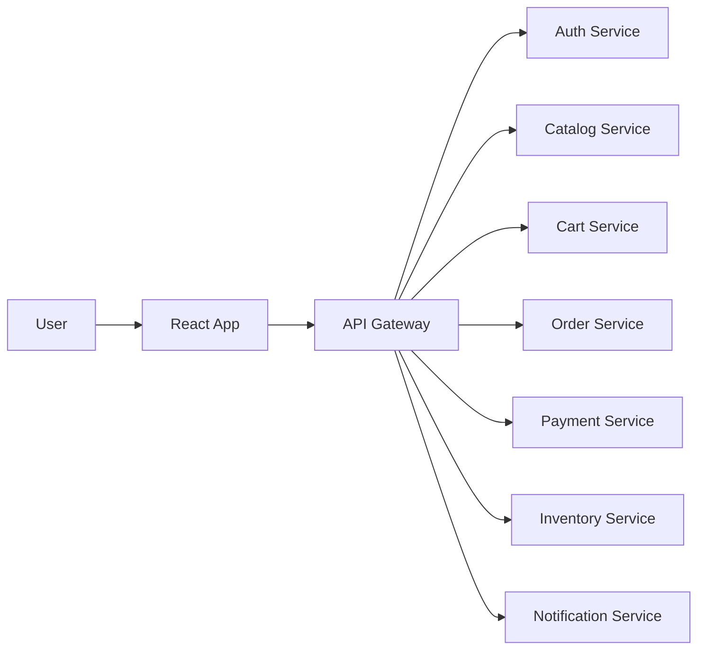

# React Frontend Guide for an E-Commerce Microservices Architecture

This file is a separate guide for building the frontend of the e-commerce system using React.

It is written for interview preparation and for understanding how the UI should be designed to work with a microservices-based backend.

---

## 1. Overview
The frontend should not be treated as a single page with random API calls. In a production-grade e-commerce application, the UI is organized by business features such as:
- Authentication
- Catalog browsing
- Cart management
- Checkout
- Orders
- Account management
- Admin operations

The React app should act as a client layer that talks to the backend services through the API Gateway.

---

## 2. High-Level Frontend Architecture



### Frontend responsibilities
- Render screens and components
- Collect user input
- Call backend APIs
- Show loading, success, and error states
- Manage authentication state
- Store cart state
- Handle navigation and routing

---

## 3. Recommended React Project Structure

```text
src/
├── app/
│   ├── routes/
│   ├── layout/
│   ├── store/
│   └── providers/
├── features/
│   ├── auth/
│   ├── catalog/
│   ├── cart/
│   ├── checkout/
│   ├── orders
│   ├── account
│   └── admin
├── shared/
│   ├── components/
│   ├── hooks
│   ├── api
│   ├── utils
│   └── styles
├── services/
│   ├── authApi.ts
│   ├── catalogApi.ts
│   ├── cartApi.ts
│   ├── orderApi.ts
│   └── paymentApi.ts
├── main.tsx
└── App.tsx
```

### Why this structure is useful
- Easy to scale
- Clear ownership of each feature
- Easy to test
- Keeps API logic separated from UI components

---

## 4. Feature-by-Feature Frontend Design

### 4.1 Authentication Feature
Responsible for:
- Login screen
- Register screen
- Forgot password screen
- Logout flow
- Token persistence

Backend mapping:
- Auth Service

Key UI components:
- LoginForm
- RegisterForm
- ProtectedRoute
- AuthProvider

Important states:
- isAuthenticated
- userDetails
- accessToken
- loading
- authError

Example flow:
```text
User -> Login Page -> Auth Service -> Dashboard/Home Page
```

### 4.2 Catalog Feature
Responsible for:
- Home page
- Product listing page
- Product detail page
- Search and filters
- Category pages

Backend mapping:
- Catalog Service

Key UI components:
- ProductCard
- ProductGrid
- SearchBar
- FiltersPanel
- ProductDetailPage

Important states:
- products
- selectedCategory
- searchQuery
- pagination
- isLoading

Example flow:
```text
User -> Home Page -> Catalog Service -> Product Listing -> Product Detail
```

### 4.3 Cart Feature
Responsible for:
- Show cart items
- Add product to cart
- Change quantity
- Remove item
- Show subtotal and total
- Apply coupon

Backend mapping:
- Cart Service

Key UI components:
- CartPage
- CartItemCard
- CartSummary
- MiniCart

Important states:
- cartItems
- cartCount
- subtotal
- shippingFee
- totalAmount

Example flow:
```text
User -> Product Detail -> Add to Cart -> Cart Page -> Checkout
```

### 4.4 Checkout Feature
Responsible for:
- Select address
- Select shipping method
- Select payment method
- Review order summary
- Place order

Backend mapping:
- Cart + Inventory + Payment + Order services

Key UI components:
- CheckoutPage
- AddressForm
- PaymentMethodSelector
- OrderSummaryCard
- PlaceOrderButton

Important states:
- selectedAddress
- selectedShippingMethod
- selectedPaymentMethod
- checkoutLoading
- orderPlaced

Example flow:
```text
User -> Checkout -> Review -> Place Order -> Success Page
```

### 4.5 Orders Feature
Responsible for:
- Order history page
- Order details page
- Track order status
- Cancel or return order

Backend mapping:
- Order Service

Key UI components:
- OrdersPage
- OrderCard
- OrderStatusTimeline

Important states:
- orders
- selectedOrder
- orderTrackingStatus

### 4.6 Account Feature
Responsible for:
- Profile update
- Address management
- Preferences
- Saved payment methods

Backend mapping:
- User Service

### 4.7 Admin Feature
Responsible for:
- Product creation/update
- Inventory updates
- Order management
- Support dashboard

Backend mapping:
- Catalog, Inventory, Order services

---

## 5. Routing Design
A proper e-commerce frontend should have clear routes:

```text
/                      -> Home page
/login                 -> Login
/register              -> Register
/products              -> Product listing
/products/:id          -> Product detail
/cart                  -> Cart page
/checkout              -> Checkout page
/orders                -> Order history
/orders/:id            -> Order detail
/account               -> Profile
/admin                 -> Admin panel
```

Recommended library:
- React Router DOM

---

## 6. State Management Strategy
A good React app should manage state in layers.

### 6.1 Local State
Use for:
- form input values
- modal visibility
- component-specific UI state

### 6.2 Global State
Use for:
- authentication state
- cart state
- user preferences

Recommended options:
- React Context for simple shared state
- Redux Toolkit or Zustand for larger apps

### 6.3 Server State
Use for:
- products
- user profile
- orders
- cart data from backend

Recommended library:
- TanStack Query (React Query)

This is important because server data changes often and should be fetched, cached, and refreshed properly.

---

## 7. API Layer Design
The React app should not directly scatter API calls in every component.

Instead, create a centralized API layer.

### Example API structure
```ts
// services/authApi.ts
export const authApi = {
  login: (data: any) => api.post('/auth/login', data),
  register: (data: any) => api.post('/auth/register', data),
  refreshToken: () => api.post('/auth/refresh')
};
```

```ts
// services/cartApi.ts
export const cartApi = {
  getCart: () => api.get('/cart'),
  addItem: (item: any) => api.post('/cart/items', item),
  updateQty: (id: string, qty: number) => api.put(`/cart/items/${id}`, { quantity: qty }),
  removeItem: (id: string) => api.delete(`/cart/items/${id}`)
};
```

```ts
// services/orderApi.ts
export const orderApi = {
  createOrder: (data: any) => api.post('/orders', data),
  getOrders: () => api.get('/orders'),
  getOrderById: (id: string) => api.get(`/orders/${id}`)
};
```

Recommended client library:
- Axios

---

## 8. Authentication and Authorization in React
The frontend must handle authentication safely.

### Recommended approach
- Use JWT-based auth
- Store token in secure storage if possible
- Protect routes using a guard component
- Show role-based UI for admin and customer users

Example concept:
```tsx
<ProtectedRoute>
  <CheckoutPage />
</ProtectedRoute>
```

### Important rules
- Unauthenticated users should be redirected to login
- Admin-only pages should be hidden from normal users
- API calls should include the auth token

---

## 9. UI/UX Design for E-Commerce
A production-grade shopping website needs strong UX.

### Key experience patterns
- Product cards with image, price, ratings, and add-to-cart button
- Search as you type
- Filters by price, category, and brand
- Sticky cart summary during checkout
- Loading skeletons instead of blank screens
- Toast notifications for successful cart updates or payment failures
- Responsive design for mobile and desktop

Recommended UI libraries:
- Tailwind CSS
- Material UI
- Ant Design
- Chakra UI

---

## 10. Example User Flows in the UI

### 10.1 Signup Flow
```text
User -> Register Page -> Auth Service -> Home Page
```

### 10.2 Browse Product Flow
```text
User -> Home Page -> Product List -> Product Detail -> Add to Cart
```

### 10.3 Checkout Flow
```text
User -> Cart -> Checkout -> Address -> Payment -> Order Success
```

### 10.4 Order Tracking Flow
```text
User -> Orders Page -> Order Detail -> Tracking Timeline
```

---

## 11. Component Design by Feature

### Auth components
- LoginPage
- RegisterPage
- ForgotPasswordPage
- ProtectedRoute

### Catalog components
- HomePage
- ProductListPage
- ProductDetailPage
- SearchBar
- FiltersPanel

### Cart components
- CartPage
- MiniCart
- CartItemRow
- CartSummary

### Checkout components
- CheckoutPage
- ShippingForm
- PaymentMethodSelector
- OrderReview

### Orders components
- OrdersPage
- OrderCard
- OrderTimeline

### Admin components
- AdminDashboard
- ProductManager
- InventoryManager
- OrderAdminPanel

---

## 12. Performance Best Practices
For a production React application:
- Use lazy loading for pages
- Split code by route
- Memoize heavy components
- Optimize images
- Paginate large product lists
- Cache API responses using React Query

Example:
```tsx
const CheckoutPage = lazy(() => import('./features/checkout/CheckoutPage'));
```

---

## 13. Testing the React Frontend
Use:
- Vitest or Jest
- React Testing Library
- Playwright or Cypress for end-to-end testing

Important tests:
- login and register flow
- add to cart
- checkout success and failure
- order history rendering
- admin access restrictions

---

## 14. Recommended Frontend Tech Stack
A modern stack for this project can be:
- React 18+
- TypeScript
- Vite
- React Router DOM
- TanStack Query
- Zustand or Redux Toolkit
- Axios
- Tailwind CSS or Material UI
- React Hook Form + Zod
- Vitest + Testing Library

---

## 15. How This Frontend Maps to the Backend Services

| Frontend Module | Backend Service |
|---|---|
| Login/Register | Auth Service |
| Product listing | Catalog Service |
| Product details | Catalog Service |
| Cart page | Cart Service |
| Checkout | Cart + Inventory + Payment + Order |
| Orders | Order Service |
| Account profile | User Service |
| Admin dashboard | Catalog + Inventory + Order |

---

## 16. Interview-Focused Summary
If asked how you would build the UI for this architecture, a strong answer would be:
- build the app as feature-based modules
- connect each module to the correct backend service
- use a centralized API layer
- manage auth and cart globally
- handle loading and failure states properly
- make the experience responsive and production-ready

---

## 17. Final Takeaway
The React frontend for an e-commerce system should be structured like the business domain itself.

A good frontend should be:
- modular
- secure
- scalable
- fast
- user-friendly
- easy to test

That is how you build a modern React experience for a production-grade e-commerce platform.
